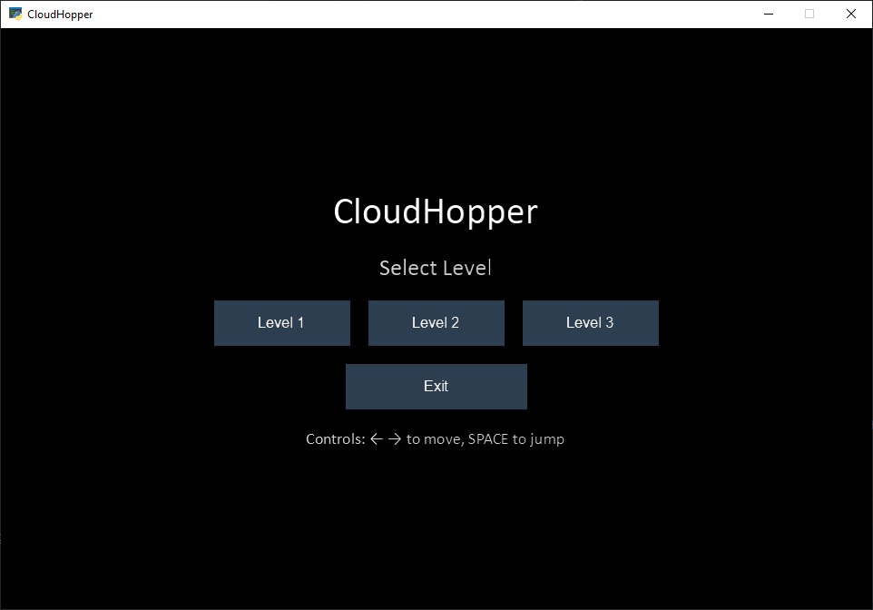
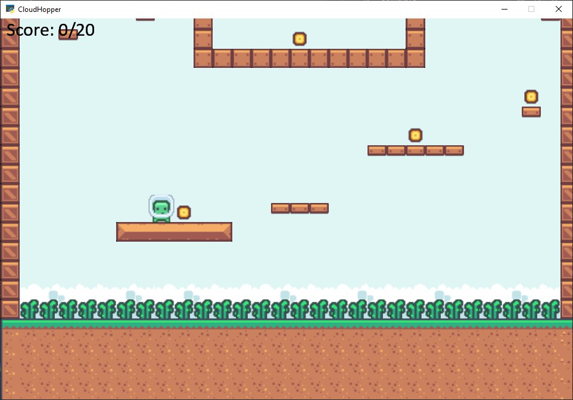
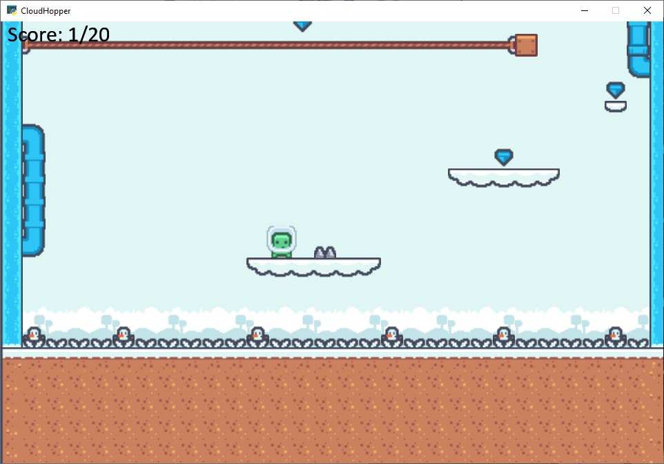
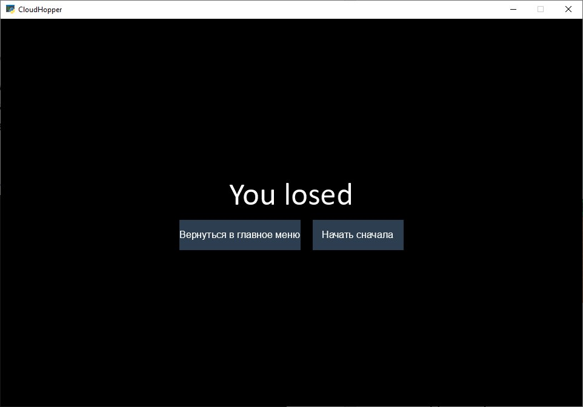

# CloudHopper

## RU

**Это вертикальный платформер с восхождением вверх. Ваша цель забраться до финиша, избегая препятствий, сражаясь с
врагами.**

### Цели проекта:

* Реализовать рабочего персонажа
* Анимация главного персонажа
* Сделать уровень
* Стартовое окно
* Некий подсчет результатов

### Используемые библиотеки:

- **pygame-arcade**

## 📋 Пояснительная записка по запуску игры

> **Важно:** Для запуска программы убедитесь, установлен Python версии не меньше **3.11** и установлена библиотека
> pygame arcade.

### 🚀 Инструкция по запуску

1. **Скачайте** архив `CloudHopper_Beta.zip`
2. **Распакуйте** в удобную папку
3. **Откройте** файл `main.py`
4. **Установите зависимости** (если требуется):
   ```bash
   pip install -r requirements.txt
5. **Запустите игру**

### 🎮 Интерфейс игры

#### Главное меню

После запуска вы увидите главное меню:



#### Выбор уровня

В игре доступны два уровня:

##### **Уровень 1**



##### **Уровень 2**



#### Результаты игры

##### **Победа**


##### **Поражение**



### 🎯 Управление

| Действие          | Клавиша            |
|-------------------|--------------------|
| **Ходьба влево**  | ← (стрелка влево)  |
| **Ходьба вправо** | → (стрелка вправо) |
| **Прыжок**        | Space (пробел)     |
| **Пауза**         | Escape (ESC)       |

## ENG

**This is a vertical platformer with climbing. Your goal is to climb to the finish line, avoiding obstacles and fighting
enemies.**

### Project Goals:

* Implement a working character
* Animation of the main character
* Make a level
* Start window
* Some kind of result calculation

### Libraries used:

- **pygame-arcade**

## 📋 Game Installation Guide

> **Important:** To run the program, make sure Python version **3.11 or higher** is installed and the **pygame arcade**
> library is set up.

### 🚀 Installation Instructions

1. **Download** the `CloudHopper_Beta.zip` archive
2. **Extract** to a convenient folder
3. **Open** the `main.py` file
4. **Install dependencies** (if required):
   ```bash
   pip install -r requirements.txt

### 🎮 Game interface

#### Main menu

After launch, you will see the main menu:


#### Level selection

Two levels are available in the game:

##### **Level 1**


##### **Level 2**


#### Game Results

##### **Win**


##### **Lose**


### 🎯 Controls

| Action         | Key             |
|----------------|-----------------|
| **Walk left**  | ← (left arrow)  |
| **Walk right** | → (right arrow) |
| **Jump**       | Space (space)   |
| **Pause**      | Escape (ESC)    |
